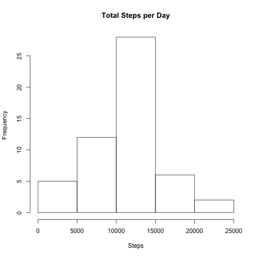
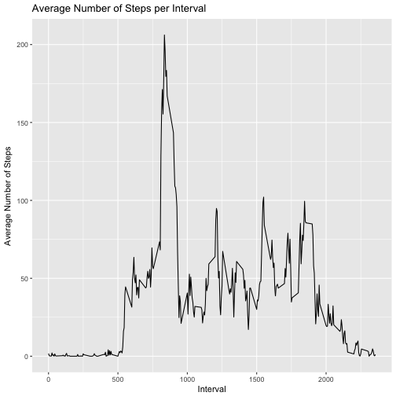
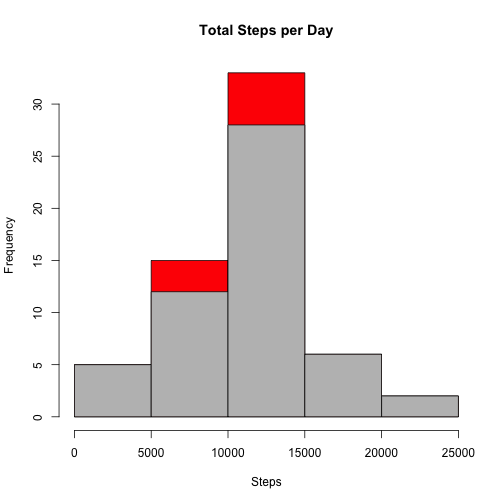
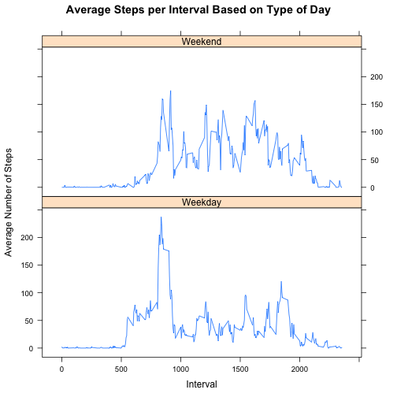

---
output:
  pdf_document: default
  html_document: default
---
# Reproducible Research Course Project 1

The following report details information about personal movement gathered from a variety of activity monitoring devices. 

## Packages Used in Script

```r
library(downloader)
library(ggplot2)
library(plyr)
library(lattice)
```

## Initial Setup and Read Data

```r
mainDir <- "~/Desktop/Coursera"
subDir <- "CourseProject1"

if (file.exists(subDir)){
        setwd(file.path(mainDir, subDir))
} else {
        dir.create(file.path(mainDir, subDir))
        setwd(file.path(mainDir, subDir))
}

## download data & read data        
download("https://d396qusza40orc.cloudfront.net/repdata%2Fdata%2Factivity.zip", dest="dataset.zip", mode="wb") 
unzip ("dataset.zip", exdir = "./")

activity <- read.csv("activity.csv")
```

## 1. Code for reading in the dataset and processing the data. 

```r
activity$day <- weekdays(as.Date(activity$date))
activity$DateTime<- as.POSIXct(activity$date, format="%Y-%m-%d")
## remove NAs
activityNArm <- activity[!is.na(activity$steps),]
```

## 2. Histogram of the total number of steps taken each day

```r
Tablesums <- aggregate(activity$steps ~ activity$date, FUN=sum, )
colnames(Tablesums)<- c("Date", "Steps")

hist(Tablesums$Steps, breaks=5, xlab="Steps", main = "Total Steps per Day")
```



## 3. Mean and median number of steps taken each day
```{r}
as.integer(mean(Tablesums$Steps))
as.integer(median(Tablesums$Steps))
```
## 4. Time series plot of the average number of steps taken
Remove NA values/create interval averages.  

```r
activityNArm <- activity[!is.na(activity$steps),]
intervalTable <- ddply(activityNArm, .(interval), summarize, Avg = mean(steps))
```
Plot

```r
p <- ggplot(intervalTable, aes(x=interval, y=Avg), xlab = "Interval", ylab="Average Number of Steps")
p + geom_line()+xlab("Interval")+ylab("Average Number of Steps")+ggtitle("Average Number of Steps per Interval")
```



## 5. The 5-minute interval that, on average, contains the maximum number of steps

```r
maxSteps <- max(intervalTable$Avg)
intervalTable[intervalTable$Avg==maxSteps,1]
```

```
## [1] 835
```

# 6. Code to describe and show a strategy for imputing missing data
Number of rows with missing values.

```r
nrow(activity[is.na(activity$steps),])
```

```
## [1] 2304
```

```r
## sub NAs with average steps by interval/day
avgTable <- ddply(activityNArm, .(interval, day), summarize, Avg = mean(steps))

##NA dataset to merge
nadata<- activity[is.na(activity$steps),]
newdata<-merge(nadata, avgTable, by=c("interval", "day"))

newdata2<- newdata[,c(6,4,1,2,5)]
colnames(newdata2)<- c("steps", "date", "interval", "day", "DateTime")

fdata <- rbind(activityNArm, newdata2)
```
Check for NA values

```r
nrow(fdata[is.na(fdata$steps),])
```

```
## [1] 0
```

## 7. Histogram of the total number of steps taken each day after missing values are imputed

```r
Tablesums2 <- aggregate(fdata$steps ~ fdata$date, FUN=sum, )
colnames(Tablesums2)<- c("Date", "Steps")

as.integer(mean(Tablesums2$Steps))
```

```
## [1] 10821
```

```r
as.integer(median(Tablesums2$Steps))
```

```
## [1] 11015
```

```r
hist(Tablesums2$Steps, breaks=5, xlab="Steps", main = "Total Steps per Day", col="Red")
hist(Tablesums$Steps, breaks=5, xlab="Steps", main = "Total Steps per Day", col="Grey", add=T)
```



Red Histogram is underlayed data with missing values imputed. 

# 8. Panel plot comparing the average number of steps taken per 5-minute interval across weekdays and weekends

```r
fdata$DayCategory <- ifelse(fdata$day %in% c("Saturday", "Sunday"), "Weekend", "Weekday")

intervalTable2 <- ddply(fdata, .(interval, DayCategory), summarize, Avg = mean(steps))

xyplot(Avg~interval|DayCategory, data=intervalTable2, type="l",  layout = c(1,2),
       main="Average Steps per Interval Based on Type of Day", 
       ylab="Average Number of Steps", xlab="Interval")
```




